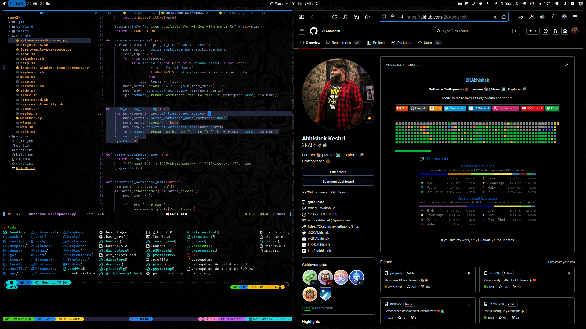

<div align = "center">

<h1><a href="https://github.com/2kabhishek/sway2k">sway2k</a></h1>

<a href="https://github.com/2KAbhishek/sway2k/blob/main/LICENSE">
 </a>

<a href="https://github.com/2KAbhishek/sway2k/graphs/contributors">
 </a>

<a href="https://github.com/2KAbhishek/sway2k/stargazers">
</a>

<a href="https://github.com/2KAbhishek/sway2k/network/members">
 </a>

<a href="https://github.com/2KAbhishek/sway2k/watchers">
 </a>

<a href="https://github.com/2KAbhishek/sway2k/pulse">
 </a>

<h3>Swaying Windows in Wayland 🎏🛣</h3>

<figure>
  
  <br/>
  <figcaption>sway2k in action</figcaption>
</figure>

</div>

My personalized configs for [sway window manager](https://swaywm.org/), minimalistic in design and optimized for developer productivity.

## ✨ Features

- Optimized for the CLI
- Comes with integrations for `foot`, `mako`, `waybar` and more
- Minimalistic UI
- Optimized for AMOLED displays

## Setup

### ⚡ Requirements

#### Packages

All the mentioned packages may not be available in your package manager, you might have to install them manually.

- `sway`: the window manager
- `foot`: wayland terminal emulator
- `waybar`: adds toolbar support
- `rofi`: app launcher
- `qutebrowser`: keyboard driven browser
- `mako`: notification daemon
- `grimshot`: screenshot support
- `wf-recorder`: screen recorder support
- `cliphist`: for clipboard management
- `wluma`: adaptive brightness support
- `wlsunset`: sunset timing support
- `light`: for display brightness
- `python`: for scripts support
- `nmtui`: network manager cli
- `bluetuith`: bluetooth manager cli
- `pulsemixer`: audio manager cli
- `bmenu`: cli menu for utilities
- `kvantum`: theme manager
  - [BWnb](https://github.com/2kabhishek/BWnb) as the Kvantum theme
  - Note: You have to manually install `BWnB` using Kvantum Manager, or it will always open the manager after restart
- FiraCode Nerd Font

```bash
# Arch
sudo pacman -S sway foot rofi waybar mako grimshot wf-recorder cliphist wluma wlsunset light python

# Debian
sudo apt install sway foot rofi waybar mako grimshot wf-recorder cliphist wluma wlsunset light python

# Fedora
sudo dnf install kvantum lxappearance kanshi calcurse
```

#### Recommended Configurations

Highly recommended to use this alongside the following configurations:

- [rofi2k](https://github.com/2kabhishek/rofi2k) as rofi config
- [qute2k](https://github.com/2kabhishek/qute2k) as quetbrowser config
- [dots2k](https://github.com/2kabhishek/dots2k) CLI Dev Environment
- [nvim2k](https://github.com/2kabhishek/nvim2k) Personalized Editor

### 🚀 Installation

```bash
git clone https://github.com/2kabhishek/sway2k
ln -sfnv "$PWD/sway2k" ~/.config/sway
```

## 💻 Usage

### Keybindings

All the configured keybindings can be found in the [keybinding manual here](./docs/keybindings.md).

### Customization

- Customize colors, icons, fonts, and more in [theme.conf](./config.d/theme.conf).
- Customize Default apps and other definitions in [definitions.conf](config.d/definitions.conf)

### Waybar Modules

Comes with a bunch of customized waybar modules:

- `menu`: app launcher
- `clock`: with calendar integration
- `weather`: powered by wttr.in
- `mode`: sway modes
- `wf-recorder`: screen recorder integration
- `pacman`: package manager integration
- `github`: GitHub notifications with gh cli
- `zeit`: task tracker integration
- `clipboard`: powered by cliphist
- `temperature`: cpu temperatures with sensors
- `cpu`: cpu usage in percentage
- `memory`: shows used ram
- `idle-inhibitor`: controls idle screen turning off
- `battery`: shows battery usages and warnings
- `sunset`: location based gamma correction
- `adaptive-light`: brightness control powered by wluma
- `backlight`: brightness control
- `playerctl`: controls media playback
- `pulseaudio`: controls audio devices
- `network`: network connections powered by nmtui
- `bluetooth`: bluetooth adapter controls
- `dnd`: mako dnd integrations
- `tray`: system tray integration

If you want to use the waybar theme by itself, you can do so by running:

```bash
# To setup waybar separately
ln -sfnv "$PWD/sway2k/waybar" ~/.config/waybar
```

## Behind The Code

### 🌈 Inspiration

A spiritual successor to [awesome2k](https://github.com/2KAbhishek/awesome2k).

I have been using awesome wm for a while and wanted to try out wayland, so I jumped in to sway!

### 💡 Challenges/Learnings

- Learned about wayland and sway APIs

### 🔍 More Info

- [awesome2k](https://github.com/2kabhishek/awesome2k) — Xorg based tiling wm configs

<hr>

<div align="center">

<strong>⭐ hit the star button if you found this useful ⭐</strong><br>

<a href="https://github.com/2KAbhishek/sway2k">Source</a>
| <a href="https://2kabhishek.github.io/blog" target="_blank">Blog </a>
| <a href="https://twitter.com/2kabhishek" target="_blank">Twitter </a>
| <a href="https://linkedin.com/in/2kabhishek" target="_blank">LinkedIn </a>
| <a href="https://2kabhishek.github.io/links" target="_blank">More Links </a>
| <a href="https://2kabhishek.github.io/projects" target="_blank">Other Projects </a>

</div>
