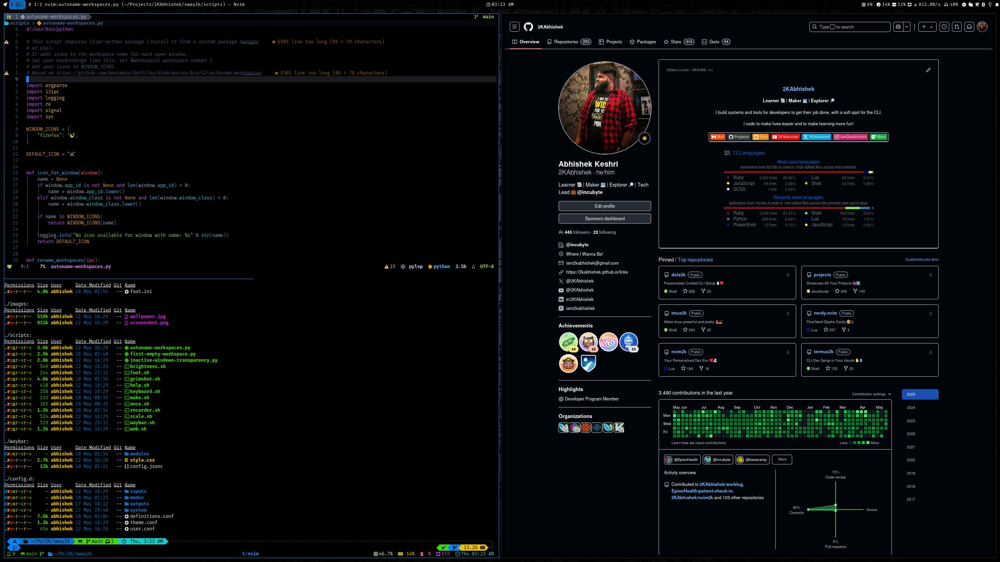

<div align = "center">

<h1><a href="https://github.com/2kabhishek/sway2k">sway2k</a></h1>

<a href="https://github.com/2KAbhishek/sway2k/blob/main/LICENSE">
 </a>

<a href="https://github.com/2KAbhishek/sway2k/graphs/contributors">
 </a>

<a href="https://github.com/2KAbhishek/sway2k/stargazers">
</a>

<a href="https://github.com/2KAbhishek/sway2k/network/members">
 </a>

<a href="https://github.com/2KAbhishek/sway2k/watchers">
 </a>

<a href="https://github.com/2KAbhishek/sway2k/pulse">
 </a>

<h3>Swaying Windows in Wayland 🎏🛣</h3>

<figure>
  
  <br/>
  <figcaption>sway2k in action</figcaption>
</figure>

</div>

My personalized configs for [sway window manager](https://swaywm.org/), minimalistic in design and optimized for developer productivity and speed.

## ✨ Features

- Optimized for keyboard driven CLI workflow
- Minimalistic UI, optimized for AMOLED displays

## Setup

### ⚡ Requirements

Run [setup.sh](setup.sh) to install dependencies on Arch-based systems, or refer to it for manual installation on other distros.

### 🚀 Installation

```bash
git clone https://github.com/2kabhishek/sway2k
cd sway2k
./setup.sh
```

#### Recommended Configurations

Highly recommended to use this alongside the following configurations:

- [dots2k](https://github.com/2kabhishek/dots2k) CLI Dev Environment
- [nvim2k](https://github.com/2kabhishek/nvim2k) Personalized Editor
- [rofi2k](https://github.com/2kabhishek/rofi2k) as rofi config
- [qute2k](https://github.com/2kabhishek/qute2k) as quetbrowser config

## 💻 Usage

### Keybindings

All the configured keybindings can be found in the [keybinding manual here](./docs/keybindings.md).

### Theming

Edit [theme.conf](./config/sway/config.d/theme.conf) to customize themes. This will override options selected via lxappearance.

#### Themix

After installing themix, find BWnB in the Contributed section, click on "Export Theme" and set the export path to `~/.local/share/themes/BWnB`

> themix can be removed after BWnB gtk theme export

#### Kvantum

Clone [BWnb](https://github.com/2kabhishek/BWnb) to a directory. Launch Kvantum Manager and select the `BWnB/kvantum/BWnB` folder and click install.

> If the theme is not installed manually, Kvantum will always open after restart.

#### Icons

Download [Reversal-blue Icons](https://www.pling.com/p/1340791) and extract it to `~/.local/share/icons` or install the downloaded `Reversal-blue.tar.xz` file via lxappearance.

#### Waybar

Details about the customized Waybar modules can be found [here](./docs/waybar.md).

## Behind The Code

### 🌈 Inspiration

Needed a light and fast go to setup for my Linux systems.

A spiritual successor to [awesome2k](https://github.com/2KAbhishek/awesome2k).

### 💡 Challenges/Learnings

- Learned about wayland and sway APIs

### 🔍 More Info

- [awesome2k](https://github.com/2kabhishek/awesome2k) — Xorg based tiling wm configs

<hr>

<div align="center">

<strong>⭐ hit the star button if you found this useful ⭐</strong><br>

<a href="https://github.com/2KAbhishek/sway2k">Source</a>
| <a href="https://2kabhishek.github.io/blog" target="_blank">Blog </a>
| <a href="https://twitter.com/2kabhishek" target="_blank">Twitter </a>
| <a href="https://linkedin.com/in/2kabhishek" target="_blank">LinkedIn </a>
| <a href="https://2kabhishek.github.io/links" target="_blank">More Links </a>
| <a href="https://2kabhishek.github.io/projects" target="_blank">Other Projects </a>

</div>
